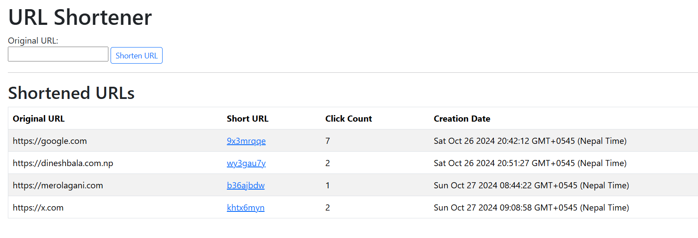

# URL Shortener

A simple Node.js application that shortens long URLs and keeps track of usage analytics, such as click count, referrer, IP address, and user agent information for each URL.



## Features

- **URL Shortening**: Converts long URLs into short, easy-to-share links.
- **Analytics Tracking**: Records data for each click, including:
  - Date and time of click
  - User's IP address
  - User agent information
- **Dashboard**: Displays a table of shortened URLs, click counts, creation dates, and optional expiration dates.

## Installation

1. **Clone the repository**:

   ```bash
   git clone https://github.com/yourusername/url-shortener.git
   cd url-shortener
   ```

2. **Install dependencies:**

```bash
  npm install
```

3. **Environment Setup:**
   Create a .env file in the root directory and set the required environment variables:

```bash
  PORT=3000
  MONGODB_URI=your_mongodb_connection_string
```

4. Run the application:

```bash
  npm start
```

5. Access the app:
   Go to http://localhost:3000 in your browser.

## Usage

- **Shorten a URL**: Use the form on the homepage to shorten a URL.
- **View Analytics**: See click analytics for each URL in a table format on the dashboard.

## Future Enhancements

- **Custom Short URL**: Allows users to specify custom URLs for their shortened links.
- **Expiration Logic**: Optionally set expiration dates for shortened URLs.
- **User Authentication**: Secure access for analytics and URL management.
- **Enhanced Analytics**: Include geographic data and device types.
- **API Access**: Provide API endpoints for creating and managing shortened URLs.

## Technologies Used

- **Node.js & Express**: Backend server and routing.
- **MongoDB**: Database for storing URL and analytics data.
- **EJS**: Template engine for rendering dynamic HTML pages.
- **CSS**: Styling for the frontend.
